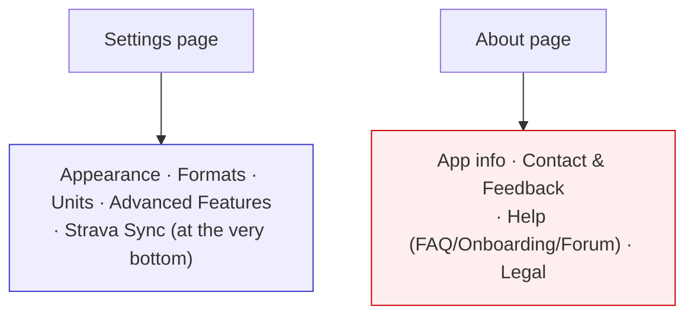
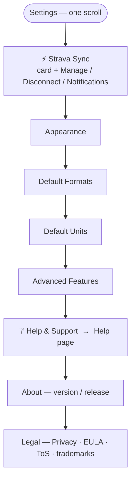
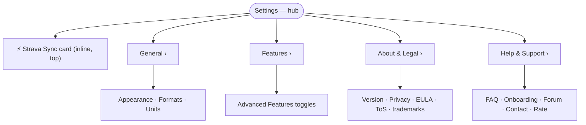
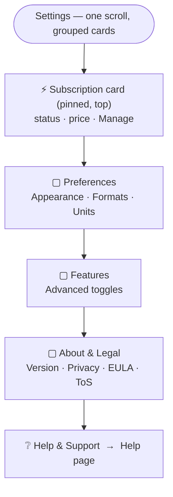
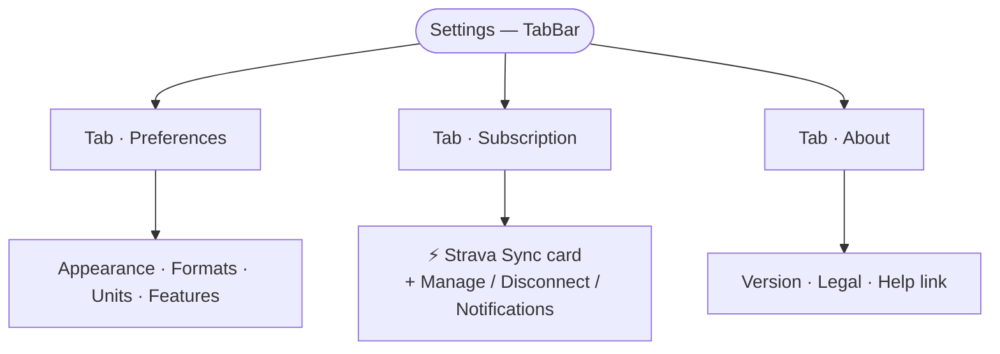

# Merged Settings / About — Organization Concepts

Concepts for combining the **Settings** ([`app_settings_page.dart`](../lib/pages/app_settings_page.dart))
and **About** ([`about_page.dart`](../lib/pages/about_page.dart)) pages into one, as part of the
home‑menu redesign.

**Already settled** (these are constraints, not open for this doc):
- The ⋮ overflow popup is replaced by a grouped **bottom‑sheet "App menu"**.
- **Help & Support** becomes its **own first‑class page** (FAQ · Onboarding · Strava Forum · Contact ·
  Rate), reached directly from the menu sheet — it is lifted *out* of About.
- The **subscription** is surfaced at the **top of Settings** *and* as a status row in the menu sheet.

**Open question (this doc):** how to organize everything that remains inside the merged Settings page.

---

## What has to live in the merged page

| Bucket | Items | Source today |
|---|---|---|
| **Subscription** | `StravaSubscriptionCard` + Manage Subscription / Disconnect / Strava Notifications | Settings (bottom) |
| **Preferences** | Appearance (theme) · Default Formats (date/time) · Default Units (×5) | Settings |
| **Features** | Advanced Features toggles (Garage, Tasks, Tags, …) | Settings |
| **About** | Version · Release date | About |
| **Legal** | Privacy Policy · EULA · Terms of Service · trademarks | About |
| *(Help — separate page)* | *FAQ · Onboarding · Forum · Contact · Rate* | *About → new Help page* |

Reusable building blocks: `SectionTitle`, `appSettingsRadioGroupSheet`,
[`launchAppUrl`/`launchAppEmail`](../lib/utils/url.dart),
[`StravaSubscriptionCard`](../lib/widgets/items/strava_subscription_card.dart),
[`FAQPage`](../lib/pages/faq_page.dart), `OnboardingPage`.

### Before

Pain points: two ambiguous destinations; Help hidden inside *About* (red); the subscription is the
last thing you reach after a long scroll (blue).

---

## Org‑A — Sectioned single page (evolve the current page)

Keep the existing single `SingleChildScrollView` + `SectionTitle` pattern; just re‑order so the
subscription is first, and append the About + Legal sections that come over from About. A single
**Help & Support** row links out to the first‑class Help page.

| Pros | Cons |
|---|---|
| Lowest effort — same widget pattern already in the file | Long single scroll (subscription + ~16 rows + about + legal) |
| Everything visible by scrolling; no extra taps | Config, about and legal all blend into one flat list |
| Subscription is the first thing seen | Section dividers do little to chunk a long page |
| Zero new navigation concepts | "Where's help?" only partly solved (one row among many) |

---

## Org‑B — Settings hub + sub‑pages (iOS‑style)

The top level becomes a short list of categories; each opens its own sub‑page. The subscription card
sits inline at the top of the hub so it stays prominent.

| Pros | Cons |
|---|---|
| Very short, scannable top level (~5 rows) | Common settings (units/formats) now cost an extra tap |
| Scales cleanly as Settings grows | Most new code — several sub‑pages/routes to build |
| Clear separation of concerns; "Help" is an obvious row | Can feel over‑structured for the current amount of content |
| Familiar iOS Settings mental model | Two scroll levels to reason about |

---

## Org‑C — Single page, grouped cards + pinned subscription (recommended)

Still one scroll, but content is chunked into Material **cards/sections** with a subscription card
pinned at the top. Visually grouped without the extra taps of a hub.

| Pros | Cons |
|---|---|
| Subscription is prominent and visually distinct | A little more layout work than Org‑A (card grouping) |
| Cards chunk the page so it scans far better than a flat list | Still one long page on small screens |
| No extra taps — everything is one scroll away | Needs a light, consistent card/section style |
| Modest, low‑risk change to the existing single‑page widget | |

---

## Org‑D — Tabbed Settings (Preferences | Subscription | About)

A `TabBar` splits the page into three short tabs; the subscription gets a dedicated tab.

| Pros | Cons |
|---|---|
| Each tab is short; no long scroll | Tabs for a settings screen are unusual on mobile |
| Subscription gets its own dedicated, prominent space | Horizontal tab nav adds a navigation concept |
| Strong separation of config vs account vs about | Subscription tab can look empty (one card) |
| | "Preferences" tab still holds most of the content |

---

## Comparison at a glance

| Criterion | Org‑A Sectioned | Org‑B Hub | Org‑C Cards | Org‑D Tabs |
|---|---|---|---|---|
| Build effort | ★ lowest | ★★★ highest | ★★ low‑mid | ★★ mid |
| Scan‑ability | ★ | ★★★ | ★★★ | ★★ |
| Taps to a common setting | ★★★ (1) | ★ (2) | ★★★ (1) | ★★ (1–2) |
| Subscription prominence | ★★ | ★★ | ★★★ | ★★★ |
| Scales as Settings grows | ★ | ★★★ | ★★ | ★★ |
| Fits current app patterns | ★★★ | ★★ | ★★★ | ★ |

## Recommendation

**Org‑C (grouped cards + pinned subscription)** is the best balance for the current content volume:
it keeps the simple one‑scroll model and the existing widget approach, makes the subscription
genuinely prominent, and chunks the page so it reads far better than today's flat list — all without
the extra taps of a hub or the unfamiliarity of tabs.

- If minimal change is the priority → **Org‑A**.
- If Settings is expected to keep growing → **Org‑B**.

> Pick a concept (or a blend, e.g. Org‑C cards + an Org‑B sub‑page for the long Advanced Features
> list) and I'll implement it per Step 2+ of the plan.
