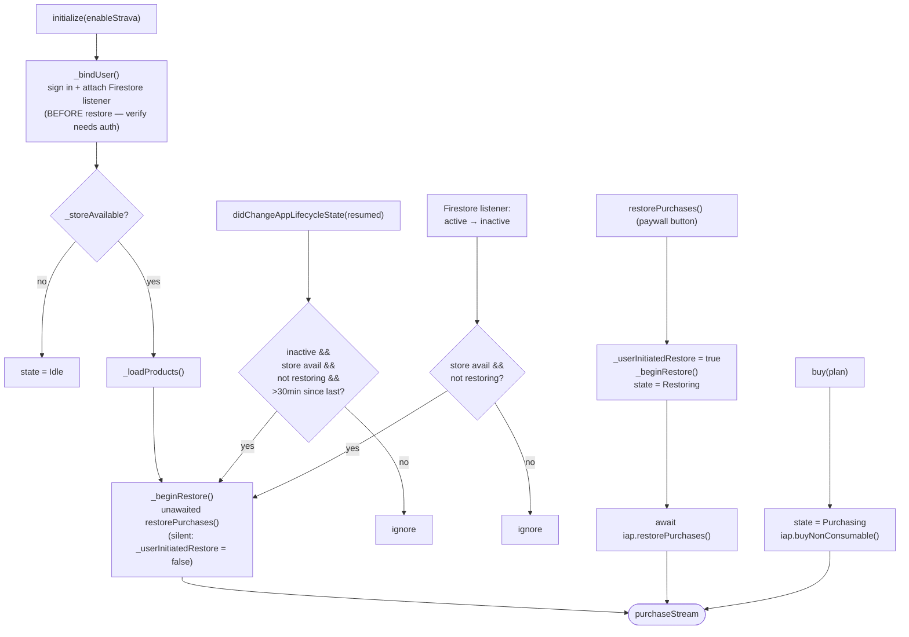
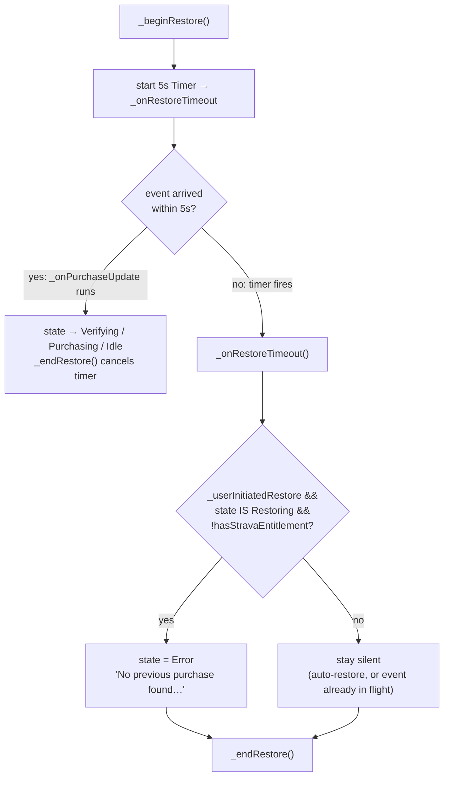
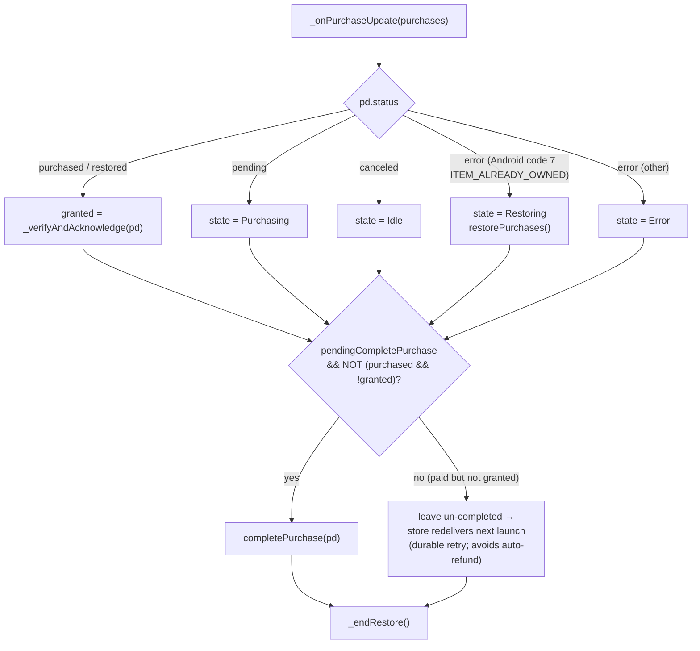
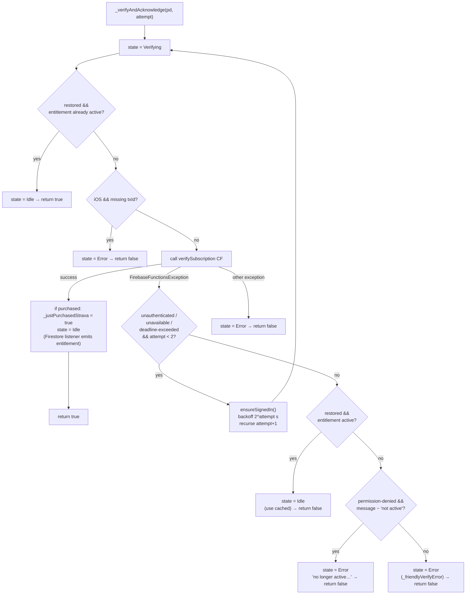

# Subscription Client Flow

Visualizes the client-side purchase / restore / verification flow in
[`lib/services/subscription_service.dart`](../lib/services/subscription_service.dart).
Firestore is the single source of truth; the client never grants entitlement
itself — it calls `verifySubscription`, then reacts to the Firestore listener.
See [20260522_subscription_architecture.md](20260522_subscription_architecture.md)
for the backend/webhook side.

---

## 1. Entry points → restore/purchase

---

## 2. `_beginRestore` timeout guard (finding-fix #1)

The 5s timer is a watchdog for *the stream staying silent*. If a purchase
event arrives, the state leaves `Restoring`, so the timeout must NOT report
"nothing found" — otherwise a slow verify (cold Cloud Function start or the
bounded transient retries) still in flight at 5s would wrongly tell the user no
purchase was found.

---

## 3. `_onPurchaseUpdate` → `_verifyAndAcknowledge`

---

## 4. `_verifyAndAcknowledge` — verification + bounded retry

---

## State legend

| State | Meaning |
|-------|---------|
| `Idle` | Resolved; UI shows paywall or dashboard based on Firestore entitlement |
| `LoadingProducts` | Querying store product details |
| `Purchasing` | Purchase dialog launched / pending |
| `Verifying` | `verifySubscription` Cloud Function in flight |
| `Restoring` | `restorePurchases` in flight (watchdog timer running) |
| `Error` | Surfaced to the user via `errorMessage` |

`return true/false` from `_verifyAndAcknowledge` is **"newly verified this
call"**, used only to decide whether a *new* (`purchased`) purchase is safe to
acknowledge. Restored purchases are already acknowledged store-side, so they
always complete regardless of the return value.
