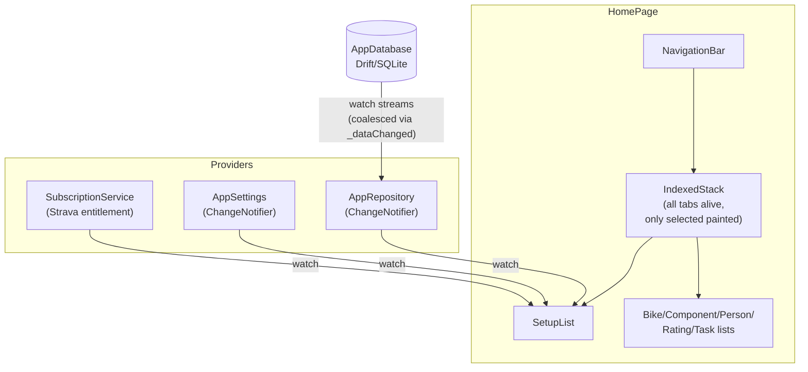
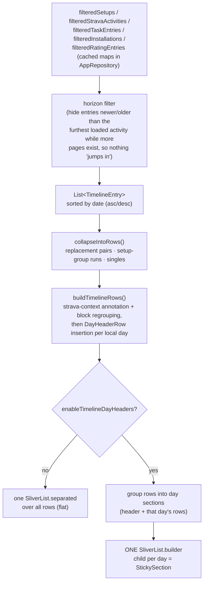
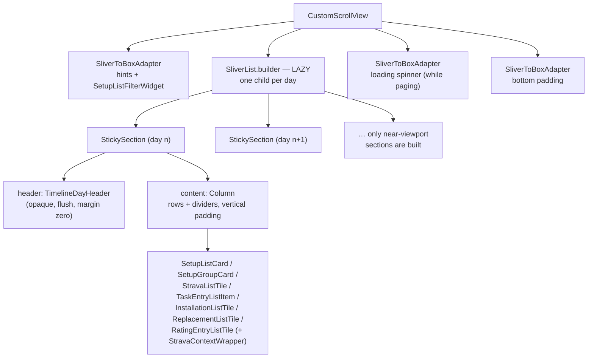
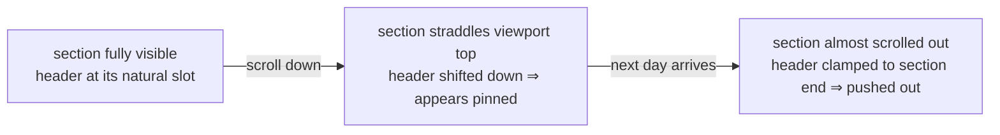
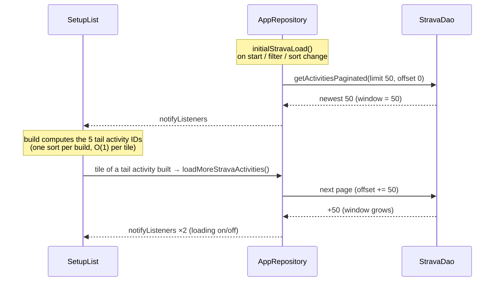

# SetupList timeline — performance investigation & current architecture

**Date:** 2026-07-26
**Status:** Implemented & validated. Cold build of a 1000-activity timeline
dropped from ~1466 ms to ~300–500 ms (debug); only ~10 of ~500 day headers are
built instead of all of them. Guarded by
`test/widgets/lists/setup_list_perf_test.dart` and
`test/widgets/sticky_section_test.dart`.

---

## 1. Initial problem

Opening the Setups tab took multiple seconds while every other tab switched
instantly; changing the sort direction was equally slow. Scrolling became
smooth only "after a while". The effect grew with the number of Strava
activities (1k+ in real data).

### Root causes (in order of impact)

| # | Cause | Cost | Fix |
|---|---|---|---|
| 1 | Sliver-per-day pinned headers: one eager `SliverMainAxisGroup` + `PinnedHeaderSliver` + header widget **per loaded day** | O(days) eager element/render-object inflation on every build — ~500 groups after deep scrolling | `StickySection` inside one lazy `SliverList` (§3) |
| 2 | `scoreForSetup` per visible card scanned all rating entries × all setups on every rebuild | O(entries × setups) per card | Per-generation lookup caches in `AppRepository` (§5) |
| 3 | Strava-context pass scanned every loaded activity per timeline row | O(rows × activities) per build | `StravaActivityIndex` binary search (§5) |
| 4 | Lazy-load trigger sorted the whole activity window per visible Strava tile | O(A log A) per tile per build | Trigger-ID set computed once per build |
| 5 | Tab switch tore down and re-inflated the whole page | full cold build per switch | `IndexedStack` in `HomePage` keeps tabs alive |
| 6 | `TimelineDayHeader` created `DateFormat`s per build | pattern re-parse × headers | static `DateFormat` cache |

Key insight behind #1: **Flutter's laziness lives inside a sliver, not
between slivers.** Children of one `SliverList` are built on demand; the
slivers of a `CustomScrollView` are all inflated eagerly and visited every
layout pass. One sliver group per day therefore scales with loaded history,
not with the viewport.

### Measurements (widget-test benchmark, debug mode, best of 3)

1000 activities over 500 days + 200 setups, 360×780 viewport. Absolute values
are machine/debug-dependent — the ratios are the finding.

| Scenario | Cold inflate |
|---|---|
| Flat list, headers off | 94 ms |
| **Sliver-per-day pinned headers (old)** | **1466 ms** |
| Old structure + grouping + replacement + ride context | 1413 ms (context passes ≈ free) |
| In-place rebuild (no teardown), old structure | 513 ms |
| Fresh 50-activity window, old structure | 170 ms |
| **`StickySection` structure (new)** | **~300–500 ms** |

---

## 2. Solution options considered

| Option | Idea | Verdict |
|---|---|---|
| A | Flat lazy list, headers as plain rows (no pinning) | Fast, but loses the pinned-day UX |
| B | Pin below a day-count threshold, flat beyond | Magic number, behavior changes mid-session |
| C | Keep tabs alive (`IndexedStack` in HomePage) | **Implemented** — complements, doesn't fix the build cost |
| D | Flat list + floating "current day" overlay (chat-app date pill) | Works, but needs scroll-offset→row mapping |
| E | Micro-optimize the eager structure | Constants shrink, O(days) inflation stays |
| F | **Sticky day-sections inside one lazy list** | **Implemented** — keeps the pinned UX 1:1, restores laziness |

---

## 3. Current architecture

### 3.1 Big picture

`HomePage` holds the tabs in a plain `IndexedStack`: every page is built once
and kept alive (state + scroll position survive switching); only the selected
child is painted. Tab switches therefore no longer re-inflate `SetupList` —
they just flip the stack index.

### 3.2 SetupList build pipeline (runs on every rebuild)

The pipeline lives in `lib/utils/timeline_grouping.dart` (pure functions,
shared with the calendar) and `SetupList.build`. Both endpoints are lazy: only
rows/sections near the viewport are ever built, so the pipeline's output size
(the loaded history) no longer determines build cost — the viewport does.

### 3.3 Widget structure with day headers enabled

### 3.4 StickySection — how pinning works without slivers

`lib/widgets/sticky_section.dart`. A `PinnedHeaderSliver` cannot be a
`SliverList` child (list children are plain `RenderBox`es with no access to
scroll geometry), so `StickySection` reproduces the pinning at the box level:

- Layout = header above content, like a column.
- A `ScrollPosition` listener marks the section for relayout on every scroll
  tick (only built, i.e. near-viewport, sections pay this).
- `performLayout` measures how far the section's top sits **above** the
  scrollable's top edge (`localToGlobal` relative to the scrollable) and
  shifts the header down by exactly that amount — clamped to the section's
  own height, so the next section pushes it out.
- Children paint content-first, so the opaque header covers rows sliding
  beneath it; hit-testing checks the header first.

Because a `StickySection` is an ordinary box, whole day-sections are children
of **one** `SliverList` and are built lazily. Rows within a day lose
individual laziness — irrelevant at the typical 1–5 rows per day.

### 3.5 Strava pagination ("the loaded window")

The window only grows within a session (reset by sort/filter change). This is
why the day count — and before the fix, the build cost — grew the deeper the
user scrolled. The horizon filter (§3.2) keeps setups/tasks/installations
beyond the furthest loaded activity hidden until their date range is paged in.

### 3.6 Caching layers (added 2026-07-25/26)

| Cache | Where | Invalidated |
|---|---|---|
| `_setupsByBike` (sorted per bike) → `resolveSetupId` via binary search | `AppRepository` | `_resolveData()` (every data change) |
| `_entriesBySetup` (rating entries grouped by resolved setup) | `AppRepository` | same |
| `_applicableMetricsByBike`, `_setupScoreCache` | `AppRepository` | same |
| `StravaActivityIndex` (activities sorted by start + running-max end; O(log n) "which ride contains this instant") | built per `collapseIntoRows` / `buildTimelineRows` call | per call |
| Lazy-load trigger-ID set (5 tail activities) | computed once per `SetupList.build` | per build |
| `DateFormat` instances | static in `TimelineDayHeader` | never (keyed by pattern) |

---

## 4. Validation

- `test/widgets/sticky_section_test.dart` — pinning geometry: header stays at
  the viewport top while its section straddles it, is pushed out by the next
  section at the exact offset, and sections are built lazily.
- `test/widgets/lists/setup_list_perf_test.dart` — permanent regression
  guard: seeds 1000 activities / 500 days + 200 setups into an in-memory DB,
  loads the full window, cold-inflates `SetupList`, and asserts **widget
  counts** (fewer than 30 of ~500 `TimelineDayHeader`s, fewer than 40 Strava
  tiles built). Wall time is printed for information only — never asserted,
  so CI stays stable across machines. Filters the unrelated
  `in_app_purchase` channel-error that constructing `SubscriptionService`
  triggers in the test environment (scoped `reportTestException` override).
- `test/utils/timeline_grouping_test.dart` — pipeline semantics (pre-existing,
  unchanged by the index refactor).

## 5. File map

| File | Role |
|---|---|
| `lib/widgets/lists/setup_list.dart` | Build pipeline endpoint; flat list vs. lazy day-section list |
| `lib/widgets/sticky_section.dart` | `StickySection` + `RenderStickySection` (box-level pinning) |
| `lib/widgets/timeline_day_header.dart` | Day header (opaque, cached `DateFormat`s) |
| `lib/utils/timeline_grouping.dart` | `collapseIntoRows`, `buildTimelineRows`, `StravaActivityIndex`, replacement pairing |
| `lib/repositories/app_repository.dart` | Filtered maps, Strava paging window, rating/score caches |
| `lib/pages/home_page.dart` | `IndexedStack` tab shell (tabs kept alive) |
