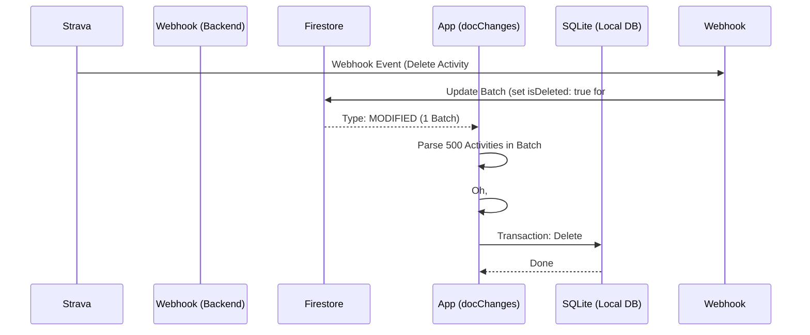
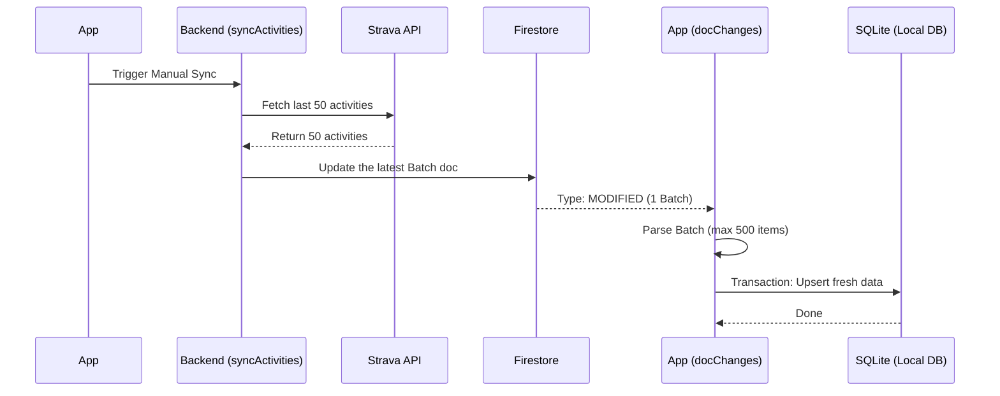
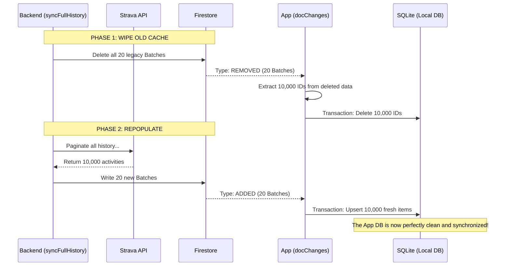

# Firestore Snapshot: `docs` vs `docChanges`

Before we look at the cases, let's understand why `docChanges` is a massive optimization over `docs`.

## `snapshot.docs`
`snapshot.docs` is a complete list of **every single document** in the collection (or query results) that currently exists in your local cache or on the server.
If you have 10,000 activities split into 20 batches of 500, `snapshot.docs` will contain all 20 batches. 
If Strava updates **one** activity in **one** batch, the listener fires, and if you loop over `snapshot.docs`, you are re-processing **all 20 batches (10,000 activities)** from scratch.

## `snapshot.docChanges`
`snapshot.docChanges` is a list of the **deltas (diffs)**. It only contains the specific documents that were `added`, `modified`, or `removed` since the last time the listener fired.
If Strava updates **one** activity in **one** batch, `snapshot.docChanges` will contain exactly **1 item**: the `modified` batch.
By looping over `docChanges`, you only process **500 activities** instead of 10,000, achieving a 95% reduction in CPU and SQLite overhead in this scenario.

---

# Sync Flow Diagrams

Below are the graphical representations of how the app handles different sync events using our optimized Tombstone + `docChanges` architecture.

## Case 1: Webhook (Add / Update / Delete)

When a single activity happens on Strava, Strava calls the webhook. The webhook modifies exactly **one** batch document in Firestore.

## Case 2: Manual Sync (Fetch Recent)

The user pulls to refresh, or the app automatically requests a background refresh of the latest 50 activities.

## Case 3: Weekly Full Sync (The Hard Reset)

The backend decides to do a massive full history sync. It wipes all existing batches and repopulates everything.
Because the app handles `Type: REMOVED` events gracefully, your local SQLite cache is perfectly mirrored without manual migrations.

